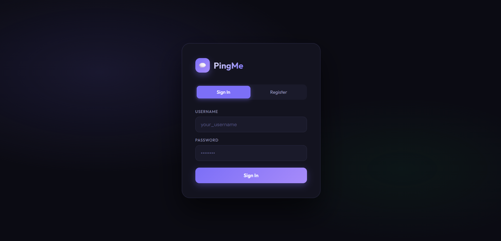
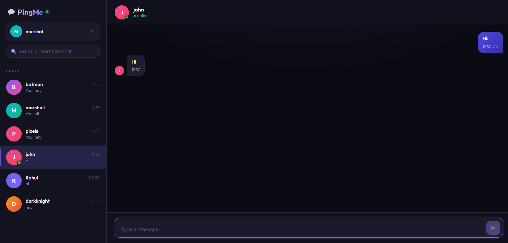
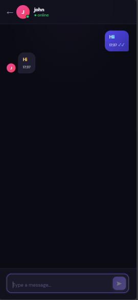
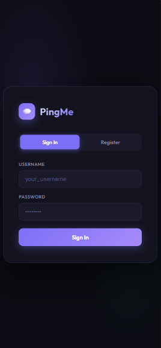
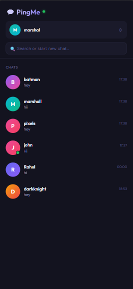
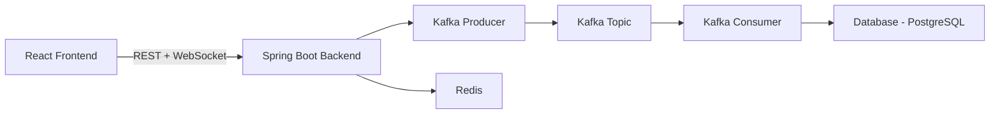
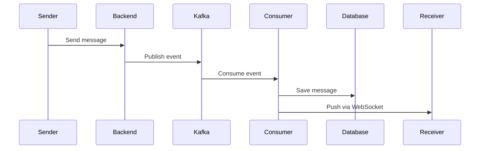

# 💬 PingMe — Real-Time Chat Application

<p align="center">
  <b>Scalable • Real-time • Event-driven Chat System</b>
</p>

<p align="center">
  
  
  
  
  
</p>

---

## 🚀 Overview

PingMe is a **scalable, real-time chat system** built with **React + Spring Boot**, leveraging **WebSockets, Kafka, and Redis** for high-performance messaging and presence tracking.

It leverages:

* ⚡ WebSockets for instant communication
* 🔄 Kafka for asynchronous message processing
* 🟢 Redis for presence tracking & rate limiting
* 🔐 JWT for secure authentication

---

## 📸 Screenshots

### 🔐 Login & Chat

| Login                      | Chat                             |
| -------------------------- | -------------------------------- |
|  |  |

---

### 📱 Mobile Views

| Chat                             | Login                             | Users                            |
| -------------------------------- | --------------------------------- | -------------------------------- |
|  |  |  |

---

## 🧠 System Design

### 🔷 Architecture



---

### 🔷 Message Flow



---

## ✨ Features

* 🔐 JWT Authentication
* 💬 Real-time messaging
* ✍️ Typing indicators
* 🟢 Online/offline presence
* 📩 Message delivery & seen status
* 🔔 Live notifications
* ⚡ Kafka-based event processing
* 🚀 Redis rate limiting

---

## 🏗️ Tech Stack

### Frontend

* React (Vite)
* WebSocket (STOMP)
* Custom Hooks

### Backend

* Spring Boot
* Spring Security (JWT)
* Kafka (Producer + Consumer)
* Redis (Presence + Rate Limiting)
* JPA / Hibernate

---

## 📁 Project Structure

```
pingme/
│
├── pingme-frontend/
├── pingme-backend/
├── screenshots/
└── README.md
```

---

## ⚙️ Local Setup

### 1️⃣ Backend

```
cd pingme-backend
./mvnw spring-boot:run
```

---

### 2️⃣ Frontend

```
cd pingme-frontend
npm install
npm run dev
```

---

## 🔌 Configuration

### Frontend

```
API=http://localhost:8081
```

---

### Backend

```
server.port=8081
spring.datasource.url=jdbc:postgresql://localhost:5432/pingme_db
spring.redis.host=localhost
spring.kafka.bootstrap-servers=localhost:9092
```

---

## ⚡ Real-Time Flow

1. User sends message → WebSocket
2. Backend → Kafka Producer
3. Kafka Consumer stores message
4. Message pushed to receiver
5. Status updated (SENT → DELIVERED → SEEN)

---

## 🧠 Key Highlights

* Event-driven architecture (Kafka)
* Stateless authentication (JWT)
* Redis-based presence tracking
* Optimized DB queries

---

## 👨‍💻 Author

**Rahul Rautela**

